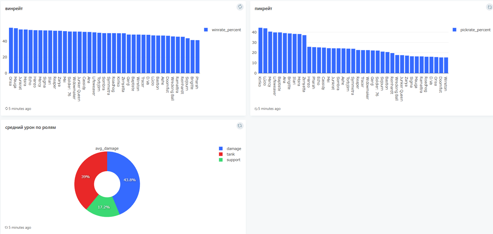

# data-analytics

## Project Overview
**Project:** Laboratory Work "Data Analysis of a Multiplayer Game"  

In this project, the following tasks were completed:

- Created a PostgreSQL database with tables `players`, `matches`, `heroes`, `maps`, and `match_players`.  
- Developed a Python data generator to simulate matches and player statistics.  
- Created a Jupyter Notebook for analyzing and visualizing game data.  
- Configured Docker containers for PostgreSQL, the data generator, and Redash.  
- Prepared visualizations of top heroes, rankings, damage, healing, and other metrics.  

---

## Database Structure

Database tables:

- **players** – information about players (`nickname`, `rank`, `email`, `phone`, `created_at`).  
- **matches** – information about matches (`started_at`, `ended_at`, `map`, `mode`).  
- **heroes** – information about heroes (`name`, `role`).  
- **maps** – information about maps (`name`, `mode`).  
- **match_players** – player statistics in matches (`kills`, `deaths`, `assists`, `damage`, `healing`, `accuracy`, `hero_id`, `role`, `rank`, `result`).  

---

## Setup

1. Clone the repository:

```bash
git clone https://github.com/yourusername/fefu-game-analytics.git
cd fefu-game-analytics
```

2. Start the PostgreSQL container:

```bash
docker compose up -d postgres
```

3. Create the Redash database:

```bash
docker-compose run --rm redash create_db
```

4. Start all containers:

```bash
docker compose up -d
```

5. To work with the Jupyter Notebook:

```bash
python -m venv .venv
.venv/Scripts/activate
pip install -r requirements.txt
jupyter note
```

When launching Jupyter Notebook, select the created virtual environment as the Kernel.

## Visualisations


